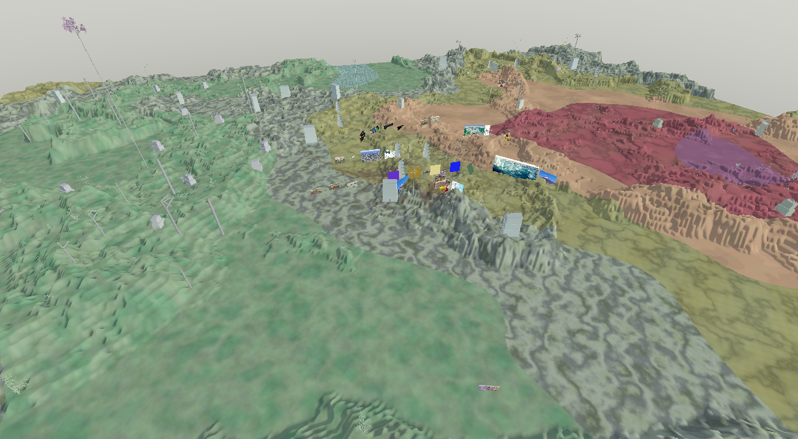

# Exodia MP

A networked multiplayer 3D virtual world where players explore procedurally generated terrain with buildings and plants, place images, videos, and text in 3D space, and leave persistent footprint trails across the landscape. Built with Vulkan, C++17, and custom TCP networking.
